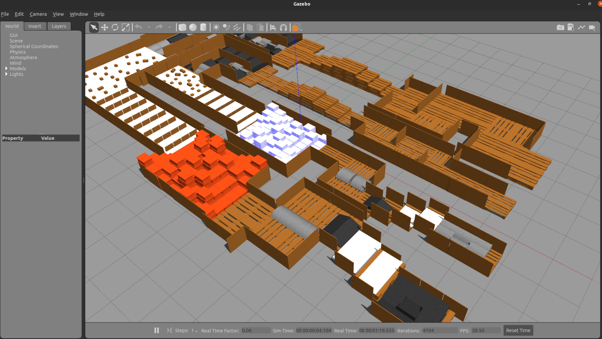

# ROS package for ICRA2023 Quadruped Robot Challenges simulation map 

- Version 1.0.1

---

<div style="display:flex;">
<div style="flex:50%; padding-right:10px; border-right: 1px solid #dcdde1">

**Package summary**

A repository for ICRA2023 Quadruped Robot Challenges. Used for build, test, and deployment.

- Maintainer status: maintained
- Maintainers
  - Jeongmin Jeon (nicky707@g.skku.edu)
  - Jinjae Shin (jinjae92@g.skku.edu)
  - Hyungpil Moon (hyungpil@g.skku.edu)
- Author
  - Jeongmin Jeon (nicky707@g.skku.edu)


</div>
<div style="flex:40%; padding-left:10px;">

**Table of Contents**
- [Overview](#overview)
- [Installation methods](#installation-methods)
    - [1. ROS](#1-ros)
    - [2. Dependencies](#2-dependencies)
    - [3. Gazebo](#3-gazebo)
    - [4. Tutorial](#4-tutorial)

</div>
</div>

---

## Overview

[](http://www.ros.org/)



- A repository for ICRA2023 Quadruped Robot Challenges. Used for build, test, and deployment.
- This repository provides a ROS URDF package for simulation map.
- You can download and check map overview from <a href="doc/ICRA2023_Quadruped_Robot_Challenges_map_overview.pdf" download>here</a>.

---

## Installation methods

ROS must be installed.

#### 1. ROS

Tested on ros-melodic and ros-noetic versions. [ROS Install](http://wiki.ros.org/melodic/Installation/Ubuntu)

#### 2. Dependencies

```bash
sudo apt-get install ros-$ROS_DISTRO-xacro ros-$ROS_DISTRO-urdf ros-$ROS_DISTRO-urdf-tutorial
sudo apt-get install ros-$ROS_DISTRO-joint-state-publisher
```

#### 3. Gazebo

```bash
sudo apt-get install ros-$ROS_DISTRO-gazebo-ros-pkgs ros-$ROS_DISTRO-gazebo-ros-control
```


#### 4. Tutorial
clone the URDF package 
```bash
cd $ROS_WORKSPACE
mkdir src
cd src
git clone https://github.com/rise-lab-skku/ICRA2023_Quadruped_Robot_Challenges
```

build & install
```bash
cd ..
catkin_make
```

visualization with Rviz
```bash
roslaunch ICRA2023_Quadruped_Robot_Challenges rviz.launch 
```

import urdf environment from gazebo
```bash
roslaunch ICRA2023_Quadruped_Robot_Challenges gazebo_world.launch 
```


In this version, we only provide a method to import the urdf environment from gazebo simulation. If you want to use another simulator, import `urdf/map.urdf` directly
